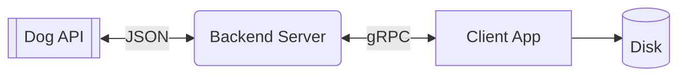

# Fetching Dog API with gRPC

This repository implements a possible solution for a backend [gRPC](https://grpc.io/) service and a command line client application to retrieve dog breed photo from [Dog API](https://dog.ceo/dog-api/documentation/breed).

I choose to use [this](https://dog.ceo/api/breed/hound/images/random) specific endpoint, so the application takes a breed as user input and gets a random image for the given breed.

A complete list of breeds to test can be found [here](https://dog.ceo/api/breeds/list/all).

Below is a mini diagram of the general flow implemented:

The server has a simple cache mechanism that expires every 60 seconds (configurable in an .env file), in order to avoid excessive requests of the same breed.

The client calculates the checksum of the URL of the breed image and if it finds a file for this URL already saved on the local disk, it does not download the same image again.

## How to run

 - Server:
	 - `cd server && go run .`
 - Client:
	 - `cd client && go run . -breed poodle`
 - Tests:
	 - `go test ./... -cover -p 1`

## Caveats

The application was made in a very simple way just to illustrate what can be done to solve the proposed problem, so some additional points can be implemented to optimize the code, as follows:

- Implement a better error handling and logging,, maybe using a more comprehensive logging library like [Logrus](https://github.com/sirupsen/logrus);
- Implement authentication and security (if deployed to AWS you can even use direct authentication on API Gateway);
- Implement a graceful shutdown mechanism for the server application;
- Try to expand the unit tests to cover more scenarios and edge cases;
- Evaluate the caching strategy used in the `InMemoryCache` implementation and maybe change to alternative caching mechanisms, such as an LRU (Least Recently Used) cache, to limit the cache size and handle cases where the cache grows indefinitely or even use a specific cache server, like [Redis](https://redis.io/) or [Memcached](https://aws.amazon.com/memcached/);
- Implement a timeout strategy for requests made to the dog API;
- Check if it is possible to refactor more the code to better readability;
- Check if it is possible to perform profiling and benchmarking of the server application to identify potential performance bottlenecks;
- If necessary, the client change could be changed to store the downloaded photos in S3.